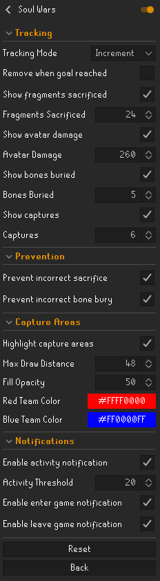

# Soul Wars

A RuneLite plugin to track in-game progress during the Soul Wars minigame, keeping a count of:
- Fragments sacrificed
- Avatar damage dealt
- Bones buried
- Areas captured

Set the target goals in the config.

Addition features:
- Prevents fragment sacrifices when obelisk is not captured
- Prevents bone buries when graveyard is not captured
- Highlight capture areas
- Notify when activity level below set threshold, entering or leaving game

## Screenshots

  

## License
This plugin is licensed under the BSD 2-Clause License. See the [LICENSE](LICENSE) file for details.
